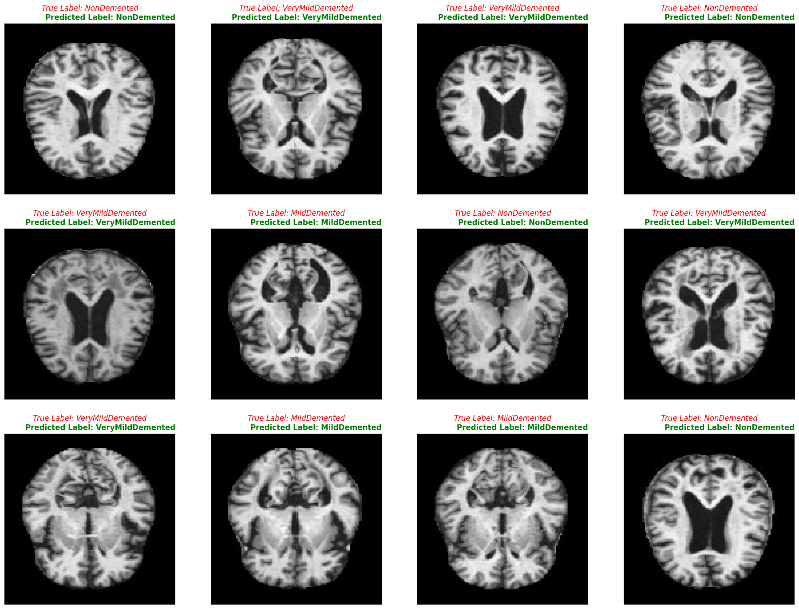

# Alzheimer prediction

Prediction of alzheimer disease based on MRI(Magnetic Resonance Imaging) Dataset using CNN.

## Work Done with Google Colab

The work contained in this repository was developed using Google Colab.

To run the code, you'll need to place the dataset file "Alzheimer_MRI_Dataset.zip" in your Google Drive.

## Dataset Kaggle
[**Augmented Alzheimer MRI Dataset**](https://www.kaggle.com/datasets/uraninjo/augmented-alzheimer-mri-dataset)

The dataset comprises four classes of images in both the training and testing sets:

1-Mild Demented

2-Moderate Demented

3-Non-Demented

4-Very Mild Demented

The data is organized into two folders: one for augmented images and the other for original images.
